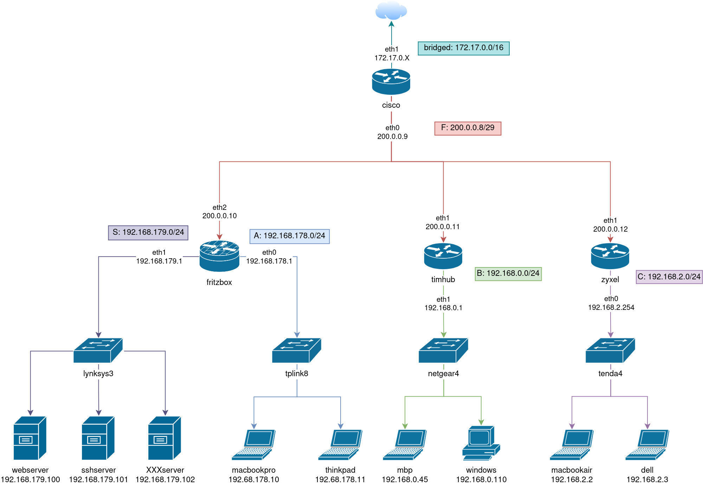

# Network scenario

## Index
1. [Network scheme](#netScheme)
2. [Description](#description)
3. [Examples](#examples)
4. [Commands](#notes)

## Network scheme

## Description {#description}
* In the local network, all hosts can be reached through the hostname
e.g. In Lan A, the thinkpad can ping macbookpro through ip `ping 192.168.179.10` or it can ping macbookpro throw hostname  `ping macbookpro` 
#### Lan A
**Router**: fritzbox
**Switch**: tplink8 with 8 available ports 
**Hostes**: macbookpro and thinkpad
**Firewall**: enabled
    
###### Chain INPUT (Policy ACCEPT)
| num | target | prot | opt | in | out | source     | destination | source port | destination port |
| --- | ------ | ---- | --- | -- | --- | ---------- | ----------- | ----- | --- |

###### Chain FORWARD (Policy ACCEPT)
| num | target | prot | opt | in | out | source          | destination       | source port | destination port |
| --- | ------ | ---- | --- | -- | --- | --------------- | ----------------- | ----- | ----- |
| 1   | REJECT | all  | --  | *  |  *  | 192.168.2.0/24  | 192.168.179.0/24  | --    | ----- |
| 2   | ACCEPT | all  | --  | *  |  *  | 192.168.178.11/24  | 192.168.179.101/24  | --    | 22 |
| 3   | ACCEPT | all  | --  | *  |  *  | 192.168.0.110/24  | 192.168.0.101/24  | --    | 22 |
| 4   | REJECT | all  | --  | *  |  *  | 0.0.0.0c/0               | 192.168.0.101/24  | --    | 22 |

###### Chain OUTPUT (Policy ACCEPT)
| num | target | prot | opt | in | out | source     | destination | source port | destination port |
| --- | ------ | ---- | --- | -- | --- | ---------- | ----------- | ----- | ----- |

#### Lan B
**Router**: timhub
**Switch**: netgear4 with 4 available ports 
**Hostes**: mbp and windows
**Firewall**: disabled
    
#### Lan C
**Router**: zyxel
**Switch**: tenda4 with 8 available ports 
**Hostes**: macbookair and dell
**Firewall**: disabled
    
#### Lan S
**Router**: fritzbox
**Switch**: linksys4 with 8 available ports 
**Hostes**: webserver sshserver XXXserver
##### Notes
+ webserver port 80
+ sshserver port 22 admin admin

#### Lan F
**Router**: cisco
**Switch**: none 
**Hostes**: fritzbox, timhub and zyxel
**Firewall**: disabled

## Examples {#examples}

##### 1. Arping
   >##### Task 1
   > Check if all hosts on the same Lan are reachable by each other. You can use the arp protocol, e.g. the windows host can reach mbp host, `arping 192.168.0.45`?
   > ##### Solution
   > Each host can reach the other hosts on the network. You can run `tcupdump` command on the destination host to check if all packets are arrived.

   >##### Task 2
   > Check if mpb on Lan B can reach thinkpad on Lan A `arping 192.168.178.11`?
   > ##### Solution
   > The arp protocol wonrs on level two of ISO/OSI Stack, so arp pakcets can't reach host of different Lan.

##### 2. Reach hostes
   >##### Task 1
   > Try to reach the webserver `192.168.179.100` on Lan S from other hostes. Try to do a ping or a curl request. Which Lan 's hostes can reach the webserver?
   > ##### Solution
   > The hostes in Lan A and Lan B can reach the webserver in the Lan S. The hstes in Lan C can't reach the webserver in Lan S because the firewall's rule block traffic.

   >##### Task 2
   > Try to reach the sshserver `192.168.179.101` on Lan S from other hostes. Try to do a ping request. Which Lan 's hostes can reach the sshserver?
   > ##### Solution
   > The hostes in Lan A and Lan B can reach the sshserver in the Lan S. The hostes in Lan C can't reach with the shserver in Lan S because the firewall's rule block traffic. 

   >##### Task 3
   > Try to enstablish a ssh conncetion to the sshserver `192.168.179.101` on Lan S. Which Lan 's hostes can reach the sshserver?
   > ##### Solution
   > It can connenct to sshserver only thinkpad on Lan A and windows on Lan B cause of firewall rules.

##### 3. How many hops?
   > ##### Exercise 1
   > ###### Task
   > How many hops does the macbookpro on Lan A have to make to reach fritzbox router on network A?
   > ###### Solution
   > 0 hops it reach directly router

   ## Commands
   * `ll` is the alias of `ls -l`
   * `ipt` is the alias of `alias ipt="/shared/./iptables.sh"` in /root/.bashrc

