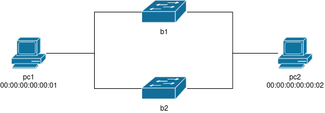

# Reti-di-Calcolatori

## Index 
1. [Network scheme](#netScheme)
2. [Description](#description)
2. [Examples](#examples)

## Network scheme {#netScheme}

## Description {#description}
This network scenario represents a network with a two bridges and two hosts.

## Examples {#examples}
### Ping

#### Task 1
Before to send icmp packets with command `ping`, check the arptables of the hosts.
##### Solution
The arptable of pc1 and the arptable of pc2 are empty because the hosts have not communicated yet. 
#### Task 2
Check if pc1 can reach pc2 `ping 192.168.1.3`?
##### Solution
The hosts' arptable have been uptated with the ip address of the pcs.
#### Task 3
If pc1 make a ping to pc2 with time to live as 1, what's happen? `ping -t 1 192.168.1.3`?
##### Solution
The packet reach pc2 and the ttl in the datagram is 1.